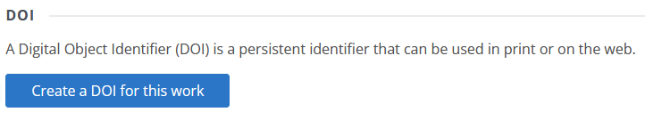

 
Draft Content
 
This guide is still in the draft stage. It may be incomplete or include inaccurate information. If you have suggestions for improving it, please <a href="https://github.com/repub/scholarsphere-docs/issues">submit an issue on GitHub</a>.

# Depositing Data & Code

Penn State researchers are encouraged to use ScholarSphere to share their work and to satisfy data availability requirements from funders and publishers. However, there are some limits on what can be shared through ScholarSphere:

- Information with a Sensitive Information Classification of Moderate (Level 2) or higher according to [Penn State Policy AD95 Information Assurance and IT Security](https://policy.psu.edu/policies/ad95) is not permitted in ScholarSphere. Examples of sensitive information that should not be deposited include: Social Security Numbers (SSNs), passport numbers, biometric data (including fingerprints, retina/facial images, and human DNA profile), birth dates, protected health information, and locations of endangered plants and animals or protected archaeological sites.
- Deposits larger than 100 GB in size require approval from repository managers in Penn State Libraries.

Please refer to [ScholarSphere's Content & Deposit Policy](https://scholarsphere.psu.edu/policies) for more complete information.

## Before You Deposit

Before beginning the deposit process, you’ll want to prepare your materials and choose a license for the submission. 

- __Document your data with a README file__: It’s important to document your dataset so that others can understand it and use it correctly. We strongly recommend including a “README.txt” file with all data submissions. Please refer to our guide for [writing READMEs](../writing-readme).
- __Convert files to open formats__:  If your data includes proprietary file formats, consider providing versions in an open format to ensure greater accessibility. The Library of Congress provides an excellent resource on recommended file formats: [https://www.loc.gov/preservation/resources/rfs/data.html#datasets](https://www.loc.gov/preservation/resources/rfs/data.html#datasets)
- __Prepare compressed archive__: If your dataset consists of multiple files (i.e., more than you would want to individually download) or if it is organized in a folder hierarchy that should be preserved, we recommend combining the files/folders in a compressed archive (e.g., .zip, or .tar.gz).
- __Choose a license__: You will need to apply a license to your data to complete the deposit process. For open datasets, we recommend the CC0 Public Domain Dedication. For code, we recommend one of the open-source software licenses. Please refer to our guide for [choosing a license](../licenses/).

## The Deposit Process: Step-by-Step

The [Deposit Overview Guide](../deposit-overview) provides a general summary of the deposit process. Here we review specific concerns related to depositing datasets and code.

### Work Details

Recommended for required fields:

- __Title__: For datasets that support a journal article, we recommend the format: "Data for: *[Article Title]*". 
- __Work Type__: Select "Dataset"
- __Description__: Provide brief description of the data. For datasets that support a journal article, you may include the article abstract.

Recommended for optional fields:

- __Keywords__: Include 3-4 descriptive keywords.
- __Related URLs__: Include links to any related journal articles or project websites
- __Geographic Area__: If the dataset relates to a specific geographical area (e.g., "State College, PA"), you may include it here.

### Contributors

On the Contributors form, please include the names of all individuals who should receive authorship credit for the dataset. You may search by name, Penn State Access ID, or ORCiD.

### Files

Upload your dataset files and README.txt here through the Files form. If the files are compressed in one or more (.zip or .tar.gz), please include the README.txt file separately.

### Review & Publish

On the Review & Publish page, you may review the information you have entered thus far. At the bottom of the form, there are two additional fields:

- __License__:  For open datasets, we recommend the CC0 Public Domain Dedication. For code, we recommend one of the open-source software licenses. Please refer to our guide for [choosing a license](../licenses/).
- __Access__: In almost all cases, the *Public* access is preferred.

To complete the deposit, review the deposit agreement, agree to it, and click "Publish".

## Assigning a DOI

After completing the deposit, you may assign a Digital Object Identifier (DOI) to your submission. This is recommended unless the submission already has a DOI from another publisher or repository. To create a DOI for your submission:

- From the work's main page, click the "Work Settings" button.
- On the Work Settings page, click "Create a DOI for this work"

## Curation

After completing the deposit, repository managers will review it to ensure that it is as complete, accessible, and understandable as possible. If they identify any required or suggested changes for you to make, they will contact you.