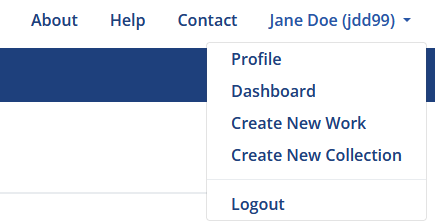
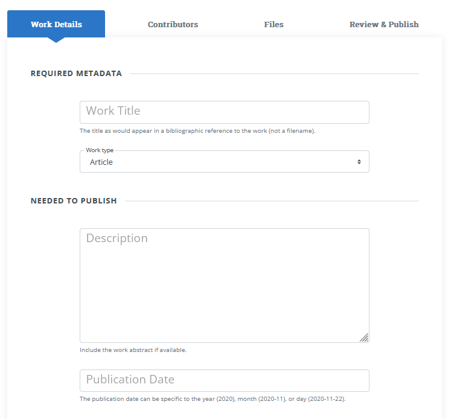
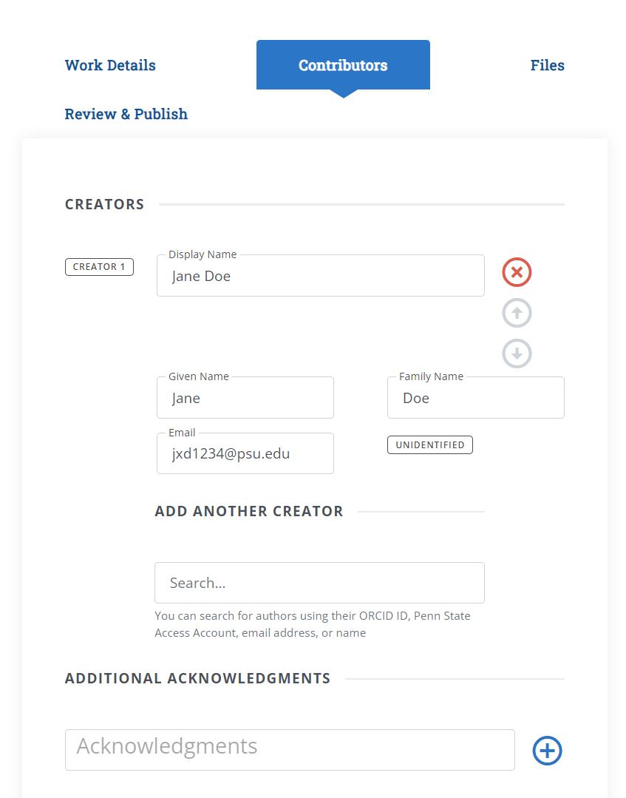
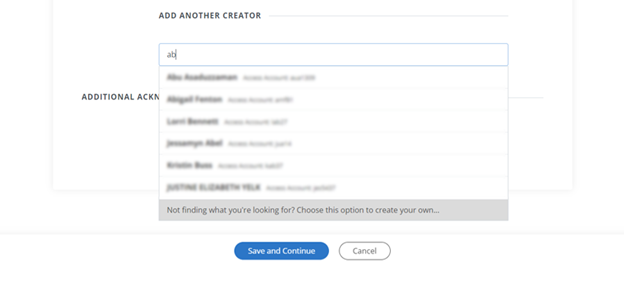
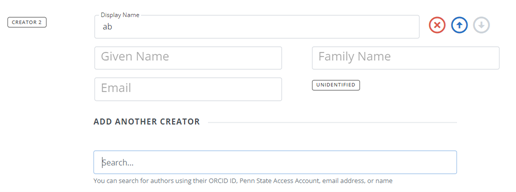
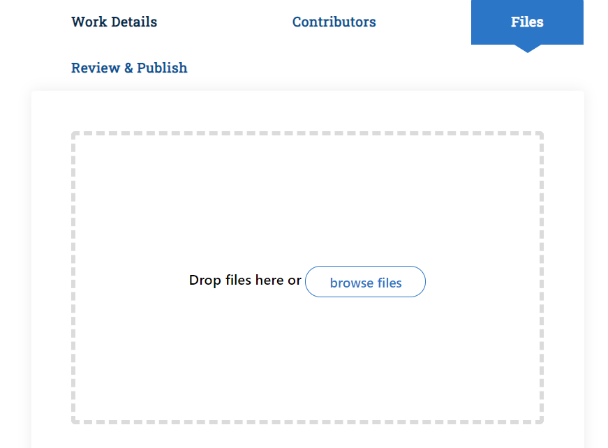
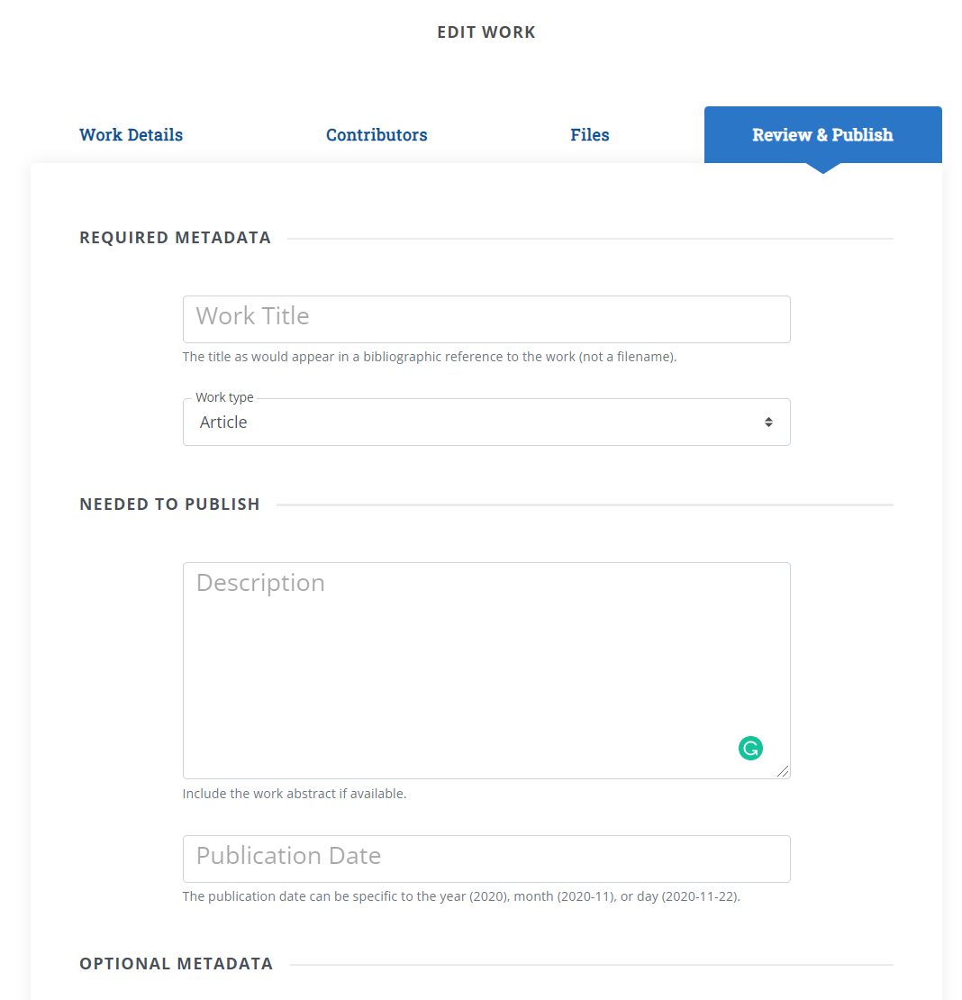
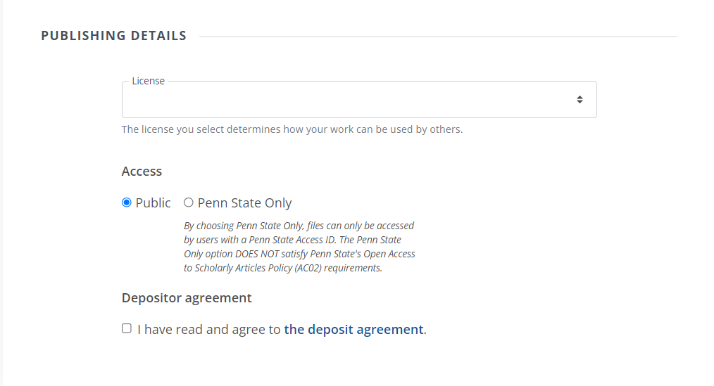

# Work Deposit Overview
<!-- This guide provides a high-level overview of the ScholarSphere deposit process. It describes each section of the 'New Work' form. -->

## First Steps

To deposit a new work to ScholarSphere, you must be logged-in with your Penn State Access account. On the home page, click "Login" in to the top right corner of the page. (If you don't see "Login", and you should your name instead, you are already logged-in).

To start the deposit process, click the menu in the top-right corner, where your name appears, and click "Create New Work".

The new work form is divided into four sections:

- __Work Details__: for entering basic metadata for the work, such as title, work type, and  description
- __Contributors__: for setting author/creator information for the work.
- __Files__: for uploading work files
- __Review and Publish__: for reviewing, setting a license, and finalizing the deposit.

At any point in the process, you can click the "Save as Draft & Exit" to save your progress. Your work will be saved as an unpublished draft. The following sections describe each part of the new work form.

## Work Details

## Contributors

You can search for authors using their ORCID ID, Penn State Access Account, email address, or name.

### Adding Non-PSU Creators

If someone is not a PSU community member, they will not appear on the list of suggested names, however the last choice on the list that you will see will say: "Not finding what you are looking for? Choose thid option to create your own."

Selecting this option will allow you to add people who don't have PSU ID and will label them as "Unidentified". 

## Files

## Review and Publish

